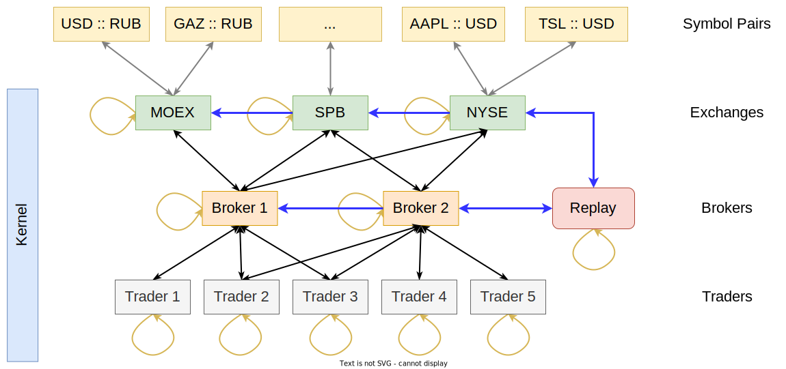
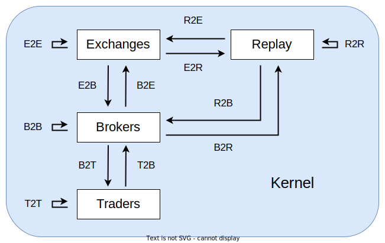

# Trading backtester
_A highly customizable framework designed for parallel tuning of trading algorithms
by reproducing and simulating the trading history of exchanges and the behaviour of brokers._

It aims to provide a complete set of interfaces needed to simulate and optimize trading and
investing algorithms at any level of precision: from the level of intra-exchange messages
to the level of price chart trading.

This project is committed to achieving:

* __The highest possible execution speed__,
  which is available through AOT compilation that runs directly to native code, low runtime,
  and great `rustc` and `LLVM` optimization abilities.

* __Low probability of making critical errors__,
  which is achieved by Rust's strong type system and borrowing rules
  that prevent the vast majority of erroneous programs from compiling.

* __High speed of writing custom code.__ This goal is achieved through
  the relatively simple syntax of the Rust language,
  which makes it no more complicated than that of C#.

## Usage

Put this in your `Cargo.toml`:

```toml
[dependencies]
trading_backtester = { path = ..., features = [ ... ] }
```

## Features

* __`concrete`__

  Concrete examples of entities that implement traits from the [`interface`] module.

* __`enum_def`__

  Provide access to the macro that generates an `enum` that can contain
  each of the listed types as a unique `enum` variant.
  Simplifies the creation of statically dispatched trait objects.

* __`enum_dispatch`__

  Provide access to derive macros for statically dispatched trait objects
  from the [`interface`] module. Convenient to use with `enum_def`.

* __`multithread`__

  Provides access to utilities for running backtesters in multiple threads.


## Overview

### General workflow



### Kernel

|  |
|:--:|
| *Kernel message management system* |